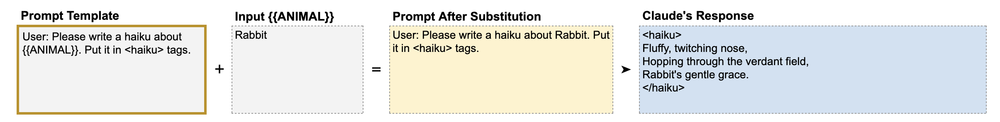
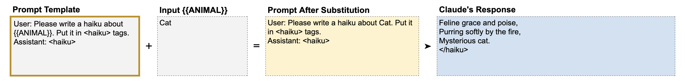

# 📘 第5章 输出格式化 & 为 Claude 续写 (Formatting Output & Speaking for Claude)

> 来源说明：Anthropic Prompt Engineering Interactive Tutorial 第5章 | 本节涵盖：XML/JSON 输出格式控制、预填充 Assistant 回复、多变量组合

---

## 🧠 核心概念总览

- [*知识点1: 用 XML 标签控制输出格式*](#id1)
- [*知识点2: 预填充——替 Claude 说话*](#id2)
- [*知识点3: JSON 格式输出 + 预填充*](#id3)
- [*知识点4: 多变量 + 动态输出标签*](#id4)

---

<a id="id1"></a>
## ✅ 知识点1: 用 XML 标签控制输出格式

**同样我们可以使用 XML 来改善输出质量...**
- Claude 能以多种方式格式化输出，只需直接要求即可
- 第4章学会了用 XML 标签让**输入**更清晰，同样可以要求 Claude 用 XML 标签让**输出**更易理解和提取
- **实际价值**：最终用户可以通过编写简单程序提取标签之间的内容，可靠地获取核心数据

- **教材示例**
    
- Claude 会将诗歌放在 `<haiku>...</haiku>` 标签中，便于程序提取。

---

<a id="id2"></a>
## ✅ 知识点2: 预填充——替 Claude 说话

**XML的另一种妙用...**
- **核心技巧**：
    - 在 `Assistant:` 之后放置起始XML 标签，告诉 Claude “你已经说了这些，请继续”
    - 而说的那些就是从你标记的第一个 XML 标签开始，然后第二标签收尾
- 这种技术称为**预填充**(`Prefilling`)或**替 Claude 说话**(`Speaking for Claude`)

- **教材示例**

- 在 `Assistant:` 后预填了 `<haiku>`，Claude 会直接输出诗歌内容，然后自然闭合 `</haiku>`
- **一举两得**：避免了前导语 + XML 标签闭合


---

<a id="id3"></a>
## ✅ 知识点3: JSON 格式输出 + 预填充

**其他输出格式...**
- Claude 也非常擅长输出 JSON 格式
- 要强制输出 JSON（接近确定但非绝对），可以预填充左花括号 `{`

**教材示例**
```
模板: "User: Please write a haiku about {{ANIMAL}}. Use JSON format with 
       the keys as 'first_line', 'second_line', and 'third_line'.
       Assistant: {"
输入: Cat
```
预填充 `{` 后，Claude 几乎一定会输出完整的 JSON 对象，而不是先说一句话再输出 JSON。

**注意点**
- ⚠️ **注意**：预填充 `{` 不能保证 100% JSON 输出，但对于绝大多数场景已经足够可靠
- 📋 **术语提醒**：`Prefilling(预填充)` = 在 Assistant 回合预先写入引导内容

---

<a id="id4"></a>
## ✅ 知识点4: 多变量 + 动态输出标签

**理论**
教程展示了一个高级组合示例，同时使用：
- 多个输入变量（`{{EMAIL}}`, `{{ADJECTIVE}}`）
- XML 标签数据分隔（`<email>...</email>`）
- 动态输出标签（用变量值作为标签名）
- 预填充（`Assistant: <{{ADJECTIVE}}_email>`）

**教材示例**
```
模板:
User: Hey Claude. Here is an email: <email>{{EMAIL}}</email>. 
Make this email more {{ADJECTIVE}}. Write the new version in 
<{{ADJECTIVE}}_email> XML tags.
Assistant: <{{ADJECTIVE}}_email>

输入 EMAIL: "Hi Zack, just pinging you for a quick update on that prompt..."
输入 ADJECTIVE: "olde english"

替换后输出标签: <olde english_email>...</olde english_email>
```

**注意点**
- 💡 **理解技巧**：动态标签名 = 模板的终极形态——变量不仅用于输入数据，还可以用于**生成标签名称**
- 🔄 **知识关联**：这综合了 Ch4（XML 分隔输入）和 Ch5（XML 格式化输出 + 预填充）的全部技术

---

## 🔑 核心要点总结
1. XML 标签双向使用：输入分隔 + 输出提取
2. 预填充是控制输出的利器——在 `Assistant:` 后写起始内容
3. 预填充 `{` → Claude 几乎一定输出 JSON
4. 可以组合多变量 + 动态标签名构建高度灵活的提示模板

---
