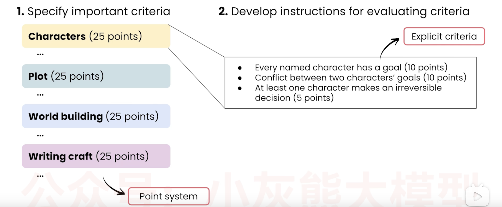
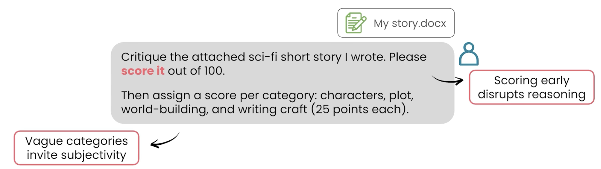
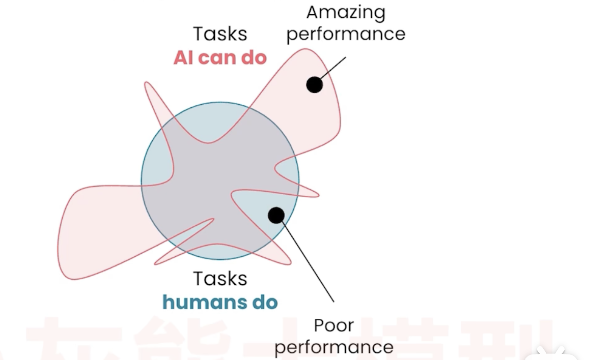

# 📘 12 用 AI 审阅 (AI Critique)

> 来源：Andrew Ng | Module 2: AI as a Thought Partner | 课时 7/7 | ~9 分钟

---

## 🧠 核心概念总览

- [*知识点1: 逐段编辑*](#id1)
- [*知识点2: 用量规（Rubric）破谄媚——客观评分法*](#id2)
- [*知识点3: 跨模型审核——用另一个 AI 来挑刺*](#id3)

---

<a id="id1"></a>
## ✅ 知识点1: 逐段编辑

**AI 永远有时间读你的稿子——人类审阅者却不一定。但如果你只对 AI 说「帮我看看这篇文章」，它大概率会拍马屁（回到第 10 课的谄媚问题）本课给你三个武器：逐段编辑、评分量规、跨模型审核**

- **核心方法**
    - 一次只处理一篇文章中的一段，比一次性审阅全文要容易管理得多

- **操作流程**
    ```
    选一段话 → 让 AI 用不同风格重新表达 → 选你喜欢的 → 下一段
    ```

- **具体案例：改写「公众认为 AGI 意味着计算机会和人一样聪明」**

    | AI 生成的变体 | 风格 |
    |-------------|------|
    | 「AGI = 人脑级别的机器智能——公众这么理解，但真相远更复杂」 | 有力版（punchy） |
    | 「人们把 AGI 想象成科幻电影里的场景……但从技术角度看……」 | 愿景版（visionary） |
    | 「说实话，大多数人理解的 AGI 其实不太对」 | 对话版（conversational） |

- 你选择最接近你想要的版本，再在那个基础上继续迭代知道你满意后，又继续下一句话的修改...

> 📋 这个方法就是把第 11 课的渐进式大纲法**下沉到段落和句子级别**

---

<a id="id2"></a>
## ✅ 知识点2: 用量规（Rubric）破谄媚——客观评分法

**如何引导去客观评判?**

- **问题**：如果你对 AI 说「请评审这篇科幻短篇」，它有很高的概率跟你说「太棒了，写得真好」。

- **解法：给 AI 一个评分量规**：
    1. 明确评判标准
    2. 明确说明如何去评估标准
- 好的量规标准必须是**二元的（是/否）**：如果 AI 有模糊空间，它就会滑向谄媚

- **好的量规示例**
    

- **Prompt 示范**
    ```
    请用以下量规评审附件中的科幻短篇。每个维度单独打分，最后加总。
    每个标准都是客观二元的「是/否」，给出证据后再判断。
    ```

- **坏的量规 vs 好的量规**

    | 坏量规 | 好量规 |
    |--------|--------|
    | 「请给这篇文章打分，满分 100」 | 先定义评分维度 → 每维单独打分 → 最后汇总 |

    

> 💡 你可以**先用 AI 来 brainstorm 量规本身**——「帮我设计一个评审这篇文章的评分维度」


---

<a id="id3"></a>
## ✅ 知识点3: 跨模型审核——用另一个 AI 来挑刺

**跨模型审核同样可以提升作品质量...**

- **做法**
    ```
    ChatGPT 写一份用户手册
        →
    Gemini 用量规评审 ChatGPT 的输出
    ```

- **评价**
    - 跨模型审核能「整合两个不同模型的知识」
    - 但只提供 **轻微的提升（a slight boost）**
    - 他自己经常把同一个 prompt 同时扔给多个模型
    - 「这不断磨练我对什么模型最适合什么任务的直觉」

- **锯齿智能（Jagged Intelligence）**
    - AI 模型在某些任务上远超人类（读海量网页、复杂数学），在另一些任务上不如人类
    - **不同模型的锯齿形状不同**
    - 因为市场竞争激烈，厂商在不断推出更好的模型
    - 「最适合你任务的那个模型会快速变化」
    

> 💡 跨模型审核的价值不只是「质量提升」，更是**让你了解不同模型的长短板**
> 📋 `Jagged Intelligence(锯齿智能)` = AI 能力不均衡：某些维度极高，某些维度意外低

---

## 🔑 本课核心要点

1. 逐段编辑 > 全文一次性审阅——每句话都过你的手
2. 评分量规（rubric）是破解审阅谄媚的利器：二元标准、逐项打分、最后汇总
3. 跨模型审核能利用不同模型的知识差异——虽然提升不大，但值得一试
4. 不同 AI 模型有不同的锯齿智能轮廓——多试才知道哪个最适合你的任务

---