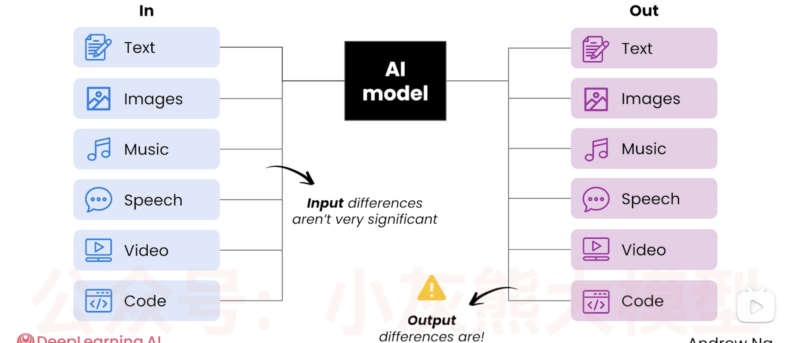

# 📘 13 处理多媒体数据 (Working with Multimedia Data)

> 来源：Andrew Ng | Module 3: Working with Multimedia & Code | 课时 1/6 | ~10 分钟

---

## 🧠 核心概念总览

- [*知识点1: 多模态 AI 的能力全景*](#id1)
- [*知识点2: 模态的成本/速度谱系*](#id2)
- [*知识点3: 技术的跨越式进步——从 2022 到现在的对比*](#id3)
- [*知识点4: 负责任的 AI 使用——语音克隆的双刃剑*](#id4)
- [*知识点5: 多模态提示的系统性差异*](#id5)

---


<a id="id1"></a>
## ✅ 知识点1: 多模态 AI 的能力全景


**AI 不只是文字工具——它现在能处理图像、语音、视频、代码**

- 现在很多AI有 <b>Multimodal(多模态)</b>能力 = AI 能理解和/或生成文本、图像、音频、视频等多种数据格式

- **案例**

    | 模态 | 案例 | 说明 |
    |------|------|------|
    | **图像生成** | 为女儿 Nova 的 7 岁生日设计猫主题蛋糕 | 用 NanoBanana 生成设计图 → 女儿选中 → 拿给面包师做成真实蛋糕。图像生成变成了「头脑风暴工具」 |
    | **视频生成** | 团队做的「人缩小了」搞笑视频 | 以前需要昂贵的特效，现在 AI 直接生成 |
    | **语音克隆** | Andrew 声音克隆朗读 *The Batch* 周刊 | 父母中有一人能分辨出克隆声音，另一人不能——质量高到真假难辨 |
    | **代码生成** | 为女儿做打字游戏 | 按对字母播放猫咪被喂食的动画——结合了猫（她喜欢的）+ 黄色（她喜欢的颜色）+ 学习需求 |

- **输入输出的组合方式**：AI 模型可以使用这些模态
    
- 例子：
    - **文本 + 图像 → 文本**：上传万圣节服装灵感图，AI 给建议
    - **音频（音乐）→ 文本 + 视频**：上传恐怖音乐，AI 设计鬼屋方案
- **差异**：
    - **输入上**：时间与成本差距微小
    - **输出上**：时间与成本差距巨大


---

<a id="id2"></a>
## ✅ 知识点2: 模态的成本/速度谱系

**具体什么差异？**

- **从快到慢、从便宜到贵**

    ```
    Text ──── Speech ──── Images ──── Video
    (最快/最便宜)                        (最慢/最贵)
    ```

    | 模态 | 速度 | 成本 | 使用建议 |
    |------|------|------|---------|
    | **Text** | 秒级 | 极低 | 默认首选，能用文字解决的不用其他 |
    | **Speech** | 秒-十秒级 | 低 | 语音交互、播客修正、游戏配音 |
    | **Images** | 数秒-数十秒 | 中等 | 设计探索、概念可视化 |
    | **Video** | 数十秒-数分钟 | **远高于其他** | 只在视频是必要输出时才用 |


> ⚠️ 多模态生成变慢，意味着「生成多个选项再挑选」的迭代策略变得更昂贵——迭代一次要好几分钟

---

<a id="id3"></a>
## ✅ 知识点3: 技术的跨越式进步——从 2022 到现在的对比

**跨越式的进步...**

- **图像生成**
    - **2022 年 Imagen**：看起来不错但有人工痕迹——"背景墙的线条不太对，洗碗中途盘子变了样"
    - **现在**：细节一致性大幅提升

- **语音克隆**
    - **早期版本**："听起来有点机械，不够有表现力"
    - **现在**："听起来更有表现力、更自然"——甚至家庭亲人都分辨不出真假


---

<a id="id4"></a>
## ✅ 知识点4: 负责任的 AI 使用——语音克隆的双刃剑

**能力越大责任越大...**

- **有益用途**
    - 播客后期修正（说错了一句话，用克隆语音修补）
    - 游戏角色配音（让独立开发者也能做出有配音的游戏）
    - 内容创作中的语音合成

- **有害用途**
    - 诈骗：用 AI 语音克隆**冒充他人**进行电话诈骗

- AI 的有益应用案例数量远超有害案例。但每个人都有责任只将 AI 用于有益和负责任的应用。


---

<a id="id5"></a>
## ✅ 知识点5: 多模态提示的系统性差异

**大多数提示词技术依然适用...**

- **不变的技巧**
    - 提供足够上下文
    - 使用最好的模型
    - 中立的 prompt 措辞

- **变得更难的操作**
    - 「生成多个选项让我挑」——因为每个选项要花数十秒甚至几分钟
    - 「快速迭代修改」——每轮迭代成本更高
- 但是如果你足够耐心，其实所有操作都适用
---

## 🔑 本课核心要点

1. 多模态 AI = 文本 + 图像 + 语音 + 视频 + 代码的输入输出组合
2. 速度/成本谱系：Text << Speech < Images <<< Video
3. 多模态技术进步极快——2022 年的图像/语音质量和现在差距悬殊
4. 之前学的 prompt 技巧在多模态下仍然有效，但迭代成本更高

---
