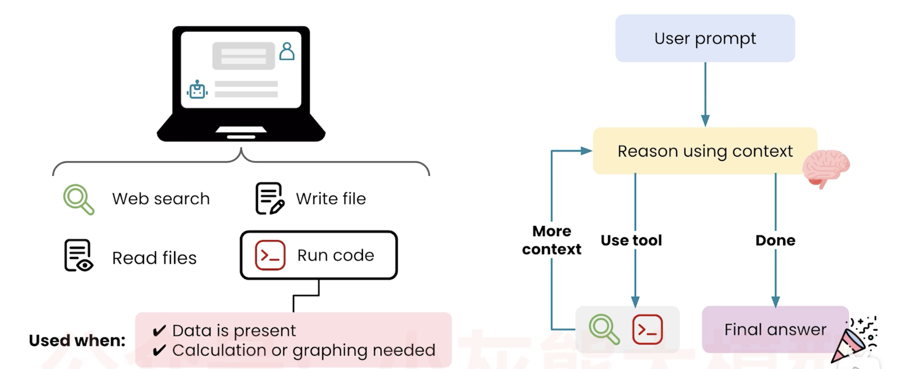
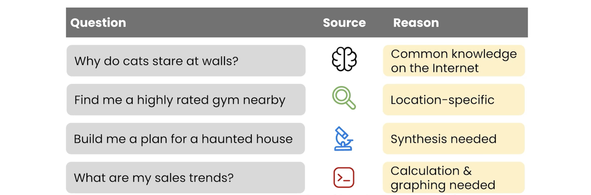
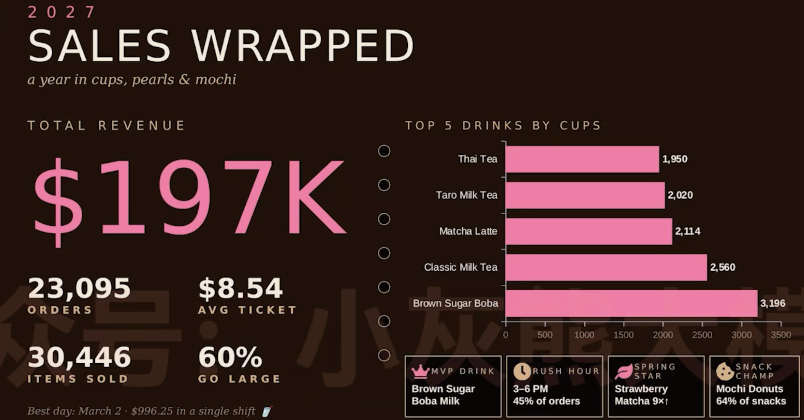

# 📘 17 数据分析 (Data Analysis)

> 来源：Andrew Ng | Module 3: Working with Multimedia & Code | 课时 5/6 | ~6 分钟

---

## 🧠 核心概念总览

- [🔗 返回课程导航](./README.md)

- [*知识点1: AI 如何执行数据分析——代码作为工具*](#id1)
- [*知识点2: 实战案例——奶茶店销售数据分析*](#id2)
- [*知识点3: 准确性*](#id3)


---

<a id="id1"></a>
## ✅ 知识点1: AI 如何执行数据分析——代码作为工具

**AI 不止能聊天——它还能写代码来分析你的数据**

- **工作机制**

    AI 把「执行代码」当作和「网络搜索」「读文件」一样的工具来调用：

    ```
    1. 你上传数据 + 提问题
        ↓
    2. AI 生成 推理提示词并判断：这需要计算/绘图 → 调用「run code」工具
        ↓
    3. AI 自动写 Python 代码
        ↓
    4. 执行代码 → 生成结果（表格、图表、洞察）用于下一步上下文，并重复以上步骤 2,3,4 知道满足得到答案的条件
        ↓
    5. AI 解读结果，用自然语言告诉你
    ```
    

- **知识获取方式的分工**

    | 问题类型 | AI 怎么做 |
    |---------|----------|
    | 常识问题 | 用预训练知识直接回答 |
    | 实时/特定信息（如地址） | 调用网络搜索 |
    | 复杂问题，涉及多个点 | 调用深度研究 |
    | **需要计算或绘图** | **写代码并执行** |

    

> 💡 AI 进行数据分析的本质是：**AI 写代码 → 代码处理数据 → AI 解读代码输出**——你是和一个会自动编程的分析师对话
> ⚠️ AI 分析「不如真正顶级的人类数据科学家精细」，但对于基本洞察完全够用

---

<a id="id2"></a>
## ✅ 知识点2: 实战案例——奶茶店销售数据分析

**通过实例理解**

- **案例 1：奶茶店——哪些饮品销售变化最大？（重点案例）**

    Prompt:
    ```
    Which drinks had the biggest changes in sales? Graph it.
    哪些饮品的销售变化最大？用图表展示。
    ```

- AI 的工作过程：
    1. 检查数据结构
    2. 计算每款饮品月环比变化
    3. 发现「大部分饮品销售平稳，但有 4 款突出」
    4. 识别并聚焦这 4 款亮眼的数据并生成图表：
    - 🍓 **草莓抹茶**春天起飞
    - 🥭 **芒果绿茶**和**草莓柠檬水**夏天爆发
    - 🥥 **椰子奶茶**秋天上升
    5. 用不同颜色高亮突出
- 工作完成后：
    1. 用户可以继续改进并迭代这张图表
    2. 请求不同的分析或调整图表内容
    - 例如**年度回顾单页**
        ```
        Create a one-slide year-in-review graphic for our bubble tea shop.
        Analyze the data carefully for insights.
        为我们的奶茶店创建一页年度回顾图。仔细分析数据寻找洞察。
        ```
        → `Analyze the data carefully` 触发更深度的 agentic 思考，生成：
        - 黑糖和经典款是**最常点的饮品**
        - 大多数顾客选择**大杯**
        - 使用了「创意的奶茶配色方案」
        
        - AI 通过代码运算来计算所以能在段时间内保证较高的正确率

> ⚠️ `analyze the data carefully for insights` 是一个触发深度分析的短语——不只做你要求的计算，还会主动找你可能没注意到的模式
> 💡 「Graph it」两个字就能让 AI 做可视化——不需要你指定图表类型

---

<a id="id3"></a>
## ✅ 知识点3: 准确性

**什么时候该信任、什么时候该核查**

- **判断**

    | AI 分析的部分 | 准确度 | 建议 |
    |-------------|--------|------|
    | **代码计算出的数字** | 「相当可能是准确的」（fairly likely to be accurate） | 可信任，但关键数字仍需核对 |
    | **AI 的文字解读** | 「有时会幻觉」（sometimes can hallucinate） | 必须用自己的领域知识交叉验证 |

- **核心原则**
    > AI 数据分析比你自己在 Excel/Sheets 里手动操作快得多，但不能替代人类的判断力。
    > 💡 信任代码，质疑解读——AI 算出来的数字通常是对的，但它对数字意义的解读可能跑偏


---

## 🔑 本课核心要点

1. AI 数据分析 = AI 写 Python 代码 → 执行 → 解读结果
2. 只需上传数据 + 自然语言提问，AI 自动完成计算和可视化
3. 计算出的数字通常可靠，但 AI 的文字解读需要人类核查
4. 善用 `analyze the data carefully for insights` 触发更深的自动分析


---